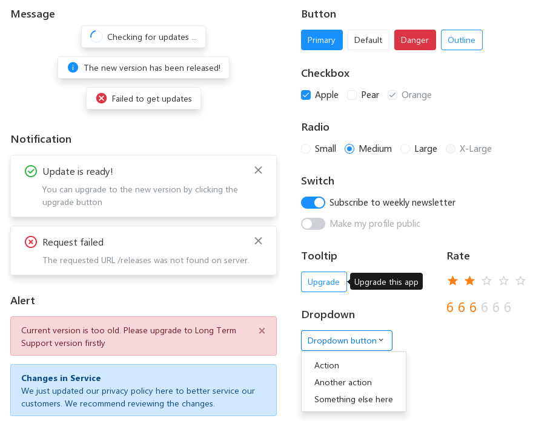

<p align="center">
  <a href="http://lcui.org">
    
  </a>

  <h3 align="center">LCDesign</h3>

  <p align="center">
    一个适用于 LCUI 应用程序的 UI 组件库
    <br>
    <a href="docs"><strong>浏览 LCDesign 的文档 &raquo;</strong></a>
  </p>
</p>

<br>

## 目录

- [介绍](#介绍)
- [组件](#组件)
- [快速开始](#快速开始)
- [构建](#构建)
    - [先决条件](#先决条件)
    - [构建目标](#构建目标)
- [安装](#安装)
- [设计参考](#设计参考)
- [作者](#作者)
- [许可](#许可)

## 介绍

([English](README.md)/**中文**)



LCDesign (LC's Design) 是一个专为 [LCUI](https://github.com/lc-soft/LCUI) 设计的 UI 组件库，它提供了用于文本排版和常用元素的基本样式、简单的布局系统、CSS 组件和实用工具。它的 CSS 代码基于 [Bootstrap](https://github.com/twbs/bootstrap)，其用法和 Bootstrap 大致一样，但需要注意的是，受限于 LCUI 现有特性以及对 CSS 标准的支持程度，并未完全实现 Boostrap 中的功能。

**注意：** 这不是 web 前端组件库，你无法用网络浏览器体验它的效果，正确的做法是下载源代码、构建、然后运行 demo 程序。

## 组件

- General 通用
  - [Button 按钮](docs/components/buttonss.md)
  - [Icon 图标](docs/content/icons.md)
  - [Typography 排版](docs/content/typography.md)
    - h1, h2, h3, h4, h5, h6
    - p
    - span
    - blockquote
    - cite
    - ...
- Navigation 导航
  - [Dropdown 下拉菜单](docs/components/dropdowns.md)
- Data Entry 数据录入
  - [Checkbox 多选框](docs/components/checkbox.md)
  - [Radio 单选框](docs/components/radio.md)
  - [Rate 评分](docs/components/rate.md)
  - [Switch 开关](docs/components/switch.md)
- Data Display 数据展示
  - [Tooltip 提示](docs/components/tooltips.md)
- Feedback 反馈
  - [Alert 警告提示](docs/components/alerts.md)
  - [Modal 对话框](docs/components/modal.md)
  - [Message 全局提示](docs/components/message.md)
  - [Notification 通知提醒框](docs/components/notification.md)
  - [Spinner 加载中](docs/components/spinners.md)

## 快速开始

有以下方式可以选择:

- 克隆并运行 [lcui/lc-design-app](https://github.com/lc-ui/lc-design-app) 示例应用以快速预览 LC Design 的示例效果

  ```bash
  # 克隆这个仓库
  git clone https://github.com/lc-ui/lc-design-app

  # 进入仓库
  cd lc-design-app

  # 安装 NodeJS 依赖包
  npm install

  # 安装适用于 x64 CPU 架构的 C/C++ 依赖库
  lcpkg install --arch x64

  # 以调试模式运行应用程序
  lcpkg run start --mode debug
  ```

- 用 [lcpkg](https://github.com/lc-soft/lcpkg) 安装

  ```bash
  # 按照默认选项来安装
  lcpkg install github.com/lc-ui/lc-design

  # 如果你需要适用于 x64 CPU 架构的版本
  lcpkg install github.com/lc-ui/lc-design --arch x64

  # 如果你需要适用于 Windows 通用应用平台(UWP) 的版本
  lcpkg install github.com/lc-ui/lc-design --arch x64 --platform uwp
  ```

- [下载最新发行版](https://github.com/lc-ui/lc-design/releases)

如果你使用的不是 Windows 系统，请继续阅读下面的内容。

## 构建

LCDesign 目前没有适用于 Linux 二进制包，你需要手动下载源码并构建它。

### 先决条件

构建 LCDesign 需要如下的依赖项：

- [XMake](http://xmake.io) - 一个构建工具，用于编译 C 源代码
- [NodeJS](https://nodejs.org) - 一个 JavaScript 运行时环境，用于运行 JavaScript 写的构建工具
- [Python](https://www.python.org/) - 一个环境，用于运行 Python 写的构建工具

在安装完它们后，你需要运行以下命令来安装相关依赖包：

```bash
    pip install misaka pygments
    npm install
```

### 构建目标

```bash
    npm run build               # 构建所有目标
    npm run build-bin           # 构建 LCUI.css 的二进制文件，包括静态库（.lib/.a）或动态库（.dll/.so）
    npm run build-css           # 构建 CSS 文件，这些文件由 src/scss/ 中的文件编译而成
    npm run build-font          # 构建图标字体文件，图标来自 Material Design Icons
    npm run build-demo          # 构建演示程序，主要功能是呈现文档
    npm run build-demo-assets   # 构建演示程序的资源文件，包括 CSS 文件和文档
    npm run build-demo-bin      # 构建演示程序的二进制文件
    npm run build-demo-css      # 构建演示程序的 CSS 文件，这些文件由 demo/src/scss/ 中的文件编译而成
    npm run build-demo-docs     # 构建演示程序的文档
    npm run demo                # 运行演示程序
```

## 安装

从 **dist** 目录中复制文件到你的项目目录，然后配置你的项目资源包含路径。

我们建议你使用如下的目录结构，这样你就能直接从 **dist/assets/** 目录中复制文件到 **yourapp/app/** 目录。

``` text
yourapp/
├── app/
│   ├── assets/
│   │   ├── stylesheets/
│   │   │   ├── app.css
│   │   │   └── lcui.css
│   │   ├── views/
│   │   │   ├── app.xml
│   │   │   └── ...
│   │   ├── fonts/
│   │   │   └── iconfont.ttf
│   │   ├── images/
│   │   └── ...
│   └── ...
├── src/
│   ├── scss/
│   ├── lib/
│   ├── ui/
│   └── ...
└── ...
```

## 设计参考

- [Bootstrap](https://github.com/twbs/bootstrap)
- [Ant Design](https://github.com/ant-design/ant-design)
- [Element UI](https://github.com/ElemeFE/element)

## 作者

**Liu Chao:**

- <https://lc-soft.io>
- <https://github.com/lc-soft>

## 许可

代码基于 [MIT 许可协议](LICENSE) 发布。
